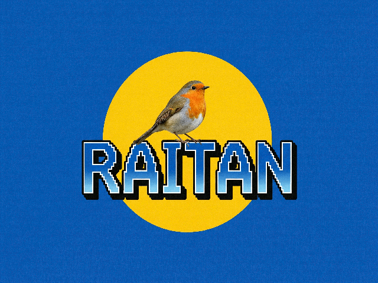

# arkanoid

Learning some OCaml by implementing this beautiful arcade game.



## Dependencies

- `dune` compiler.
- `base`, `tsdl`, `tsdl-image`, and `tsdl-ttf` opam libraries.

## Build

```shell
$ dune build
```

## Execute

```shell
$ dune exec arkanoid
```
